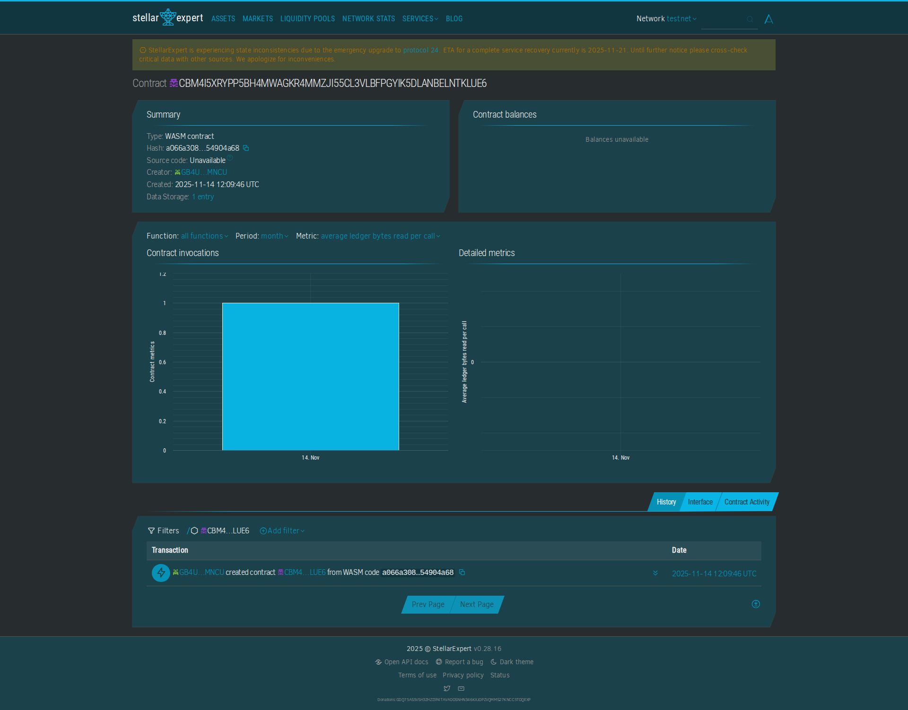

# Task Progress

## Project Description
The Task Progress contract enables users to track task progress on the Stellar blockchain. It allows associating task IDs with progress values, creating an immutable record of completion status. This provides a transparent way to track task progress that cannot be manipulated. The contract uses minimal storage to keep costs low.

This contract is perfect for project managers, teams, or individuals who need to track task progress in a transparent and verifiable way. By storing task progress on the blockchain, you create a permanent record that cannot be altered, providing accurate tracking for project management, team coordination, or personal productivity. The contract is ideal for project tracking, task management, progress monitoring, or any scenario where you need to maintain a permanent record of task completion status.

**Key Benefits:**
- **Permanent Records**: Task progress is stored permanently on the blockchain
- **Transparency**: All progress updates are publicly verifiable
- **Team Coordination**: Multiple team members can track progress transparently
- **No Manipulation**: Progress values cannot be altered or deleted
- **Cost-Effective**: Low storage costs for maintaining task progress records
- **Global Access**: Track task progress from anywhere



**Contract Address:** `CBM4I5XRYPP5BH4MWAGKR4MMZJI55CL3VLBFPGYIK5DLANBELNTKLUE6`

**View on Stellar Expert:** [https://stellar.expert/explorer/testnet/contract/CBM4I5XRYPP5BH4MWAGKR4MMZJI55CL3VLBFPGYIK5DLANBELNTKLUE6](https://stellar.expert/explorer/testnet/contract/CBM4I5XRYPP5BH4MWAGKR4MMZJI55CL3VLBFPGYIK5DLANBELNTKLUE6)

## Features
- Simple getter function to retrieve task progress
- Simple setter function to update progress
- Basic storage model using task ID to progress mapping
- Minimal, gas-efficient logic

## Building the Contract

To build use:
```bash
stellar contract build
```

## Deploy to Testnet
Run:

```bash
stellar contract deploy \
  --wasm target/wasm32v1-none/release/project-50.wasm \
  --source-account alice \
  --network testnet \
  --alias project-50
```


